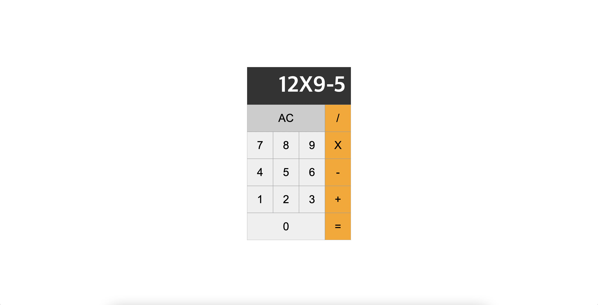
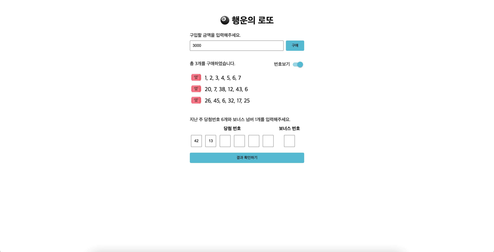
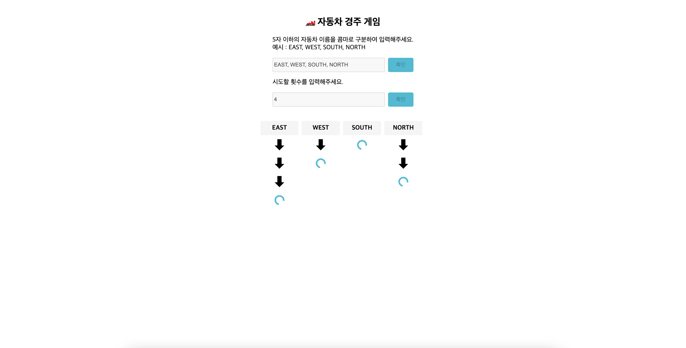

# NEXTSTEP Clean Code with JavaScript 2기 
> 기간 : 2022-03-08 ~ 2022-04-26

 

 

<h2>🧮 온보딩 미션 : 계산기 🧮</h2>

<a href="https://inseong-so.github.io/js-calculator/">구현 페이지</a>

<a href="https://github1s.com/inseong-so/js-calculator/">저장소 코드</a>

Pull Rquest : <a href="https://github.com/next-step/js-calculator/pull/89">STEP1</a>

 

 

<h2>🎰 미션1 : 로또 🎰</h2>

<a href="https://inseong-so.github.io/js-lotto/">구현 페이지</a>

<a href="https://github1s.com/inseong-so/js-lotto/">저장소 코드</a>

Pull Rquest : <a href="https://github.com/next-step/js-lotto/pull/83">STEP1</a>, <a href="https://github.com/next-step/js-lotto/pull/112">STEP2</a>

 

 

<h2>🚗 미션2 : 레이싱게임 🚗</h2>

<a href="https://inseong-so.github.io/js-racingcar/">구현 페이지</a>

<a href="https://github1s.com/inseong-so/js-racingcar/">저장소 코드</a>

Pull Rquest : <a href="https://github.com/next-step/js-racingcar/pull/62">STEP1 ~ 3</a>

 

 

<h2>🏧 미션3 : 자판기 🏧</h2>

<a href="https://inseong-so.github.io/js-vending-machine/">구현 페이지</a>

<a href="https://github1s.com/inseong-so/js-vending-machine/">저장소 코드</a>

Pull Rquest : <a href="https://github.com/next-step/js-vending-machine/pull/30">STEP1 ~ 4</a>

 

 